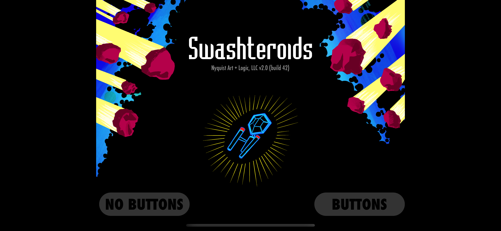

# Swashteroids
_An example using the Swash framework_

[Swashteroids](https://apps.apple.com/us/app/swashteroids/id6472061502) is a game I made with the ECS framework [Swash](https://github.com/johnrnyquist/Swash) along with some SpriteKit. Get it in the App Store!

Here's a [video](https://www.youtube.com/watch?v=WM2IAM2pBCY) of the gameplay.

#### Developer
- [John Nyquist](https://linkedin.com/in/nyquist)

#### Thank You
- [Swash](https://github.com/johnrnyquist/Swash) is based on the brilliant [Ash](https://github.com/richardlord/Ash) framework by [Richard Lord](https://richardlord.net). 

#### License
- This project is licensed under the MIT License - see the LICENSE.md file for details
